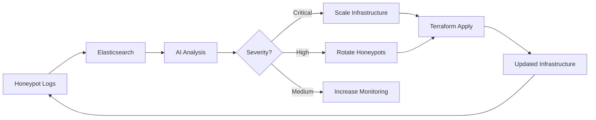

<!--
Creators: Pawel M (pmaksymiak), Kylo P (cywf)
Date: 2023-03-25
-->

# Project Asylum

Project Asylum is a **self-adapting infrastructure management framework** that uses AI/ML, Terraform, and monitoring tools to build secure, evolving honeypot environments. The system automatically analyzes attacker behavior, detects anomalies, and adapts its infrastructure in real-time to maximize deception and security research value.

## 🎯 Core Features

- **🤖 AI/ML Adaptation Engine**: TensorFlow-based anomaly detection that learns from attacker behavior
- **🏗️ Infrastructure as Code**: Modular Terraform configurations for Docker, Proxmox, AWS, GCP, and Azure
- **📊 Comprehensive Monitoring**: Prometheus, Grafana, and ELK Stack for metrics and log analysis
- **🍯 Honeypot System**: Cowrie SSH/Telnet honeypot with automatic configuration rotation
- **🔄 Orchestration Layer**: Event-driven automation with Node.js API and message queue
- **🔁 Feedback Loop**: Continuous analysis and infrastructure adaptation based on detected threats
- **🔒 Security First**: Built-in secret management, least-privilege access, and TLS encryption

## 🚀 Quick Start

### Prerequisites

- **Docker & Docker Compose** (20.10+)
- **Terraform** (1.0+)
- **Git**

Optional for cloud deployment:
- AWS CLI / GCP SDK / Azure CLI (configured with credentials)

### One-Command Deployment

```bash
# Clone the repository
git clone https://github.com/folkvarlabs/project-asylum.git
cd project-asylum

# Copy environment configuration
cp .env.example .env

# Start all services
docker-compose up -d
```

That's it! The system will start with:
- 🍯 Cowrie honeypot on ports 2222-2223
- 📊 Grafana dashboard at http://localhost:3000 (admin/asylum_admin_2024)
- 📈 Prometheus at http://localhost:9090
- 🔍 Kibana at http://localhost:5601
- 🤖 AI API at http://localhost:8000
- 🎛️ Orchestration API at http://localhost:3001

### Verify Deployment

```bash
# Check all services are running
docker-compose ps

# View logs
docker-compose logs -f

# Test honeypot
ssh -p 2222 root@localhost

# Check AI API
curl http://localhost:8000/health

# View metrics
curl http://localhost:9090/metrics
```

## 📁 Project Structure

```
project-asylum/
├── terraform/              # Infrastructure as Code
│   ├── modules/
│   │   ├── docker/        # Local Docker deployment
│   │   ├── aws/           # AWS cloud deployment
│   │   ├── gcp/           # Google Cloud deployment
│   │   └── azure/         # Azure cloud deployment
│   ├── envs/
│   │   ├── dev/           # Development environment
│   │   └── prod/          # Production environment
│   ├── main.tf
│   ├── variables.tf
│   └── outputs.tf
│
├── ai/                     # AI/ML Adaptation Engine
│   ├── model/
│   │   └── anomaly_detector.py  # TensorFlow anomaly detection
│   ├── api/
│   │   └── main.py        # FastAPI REST interface
│   ├── train.py           # Model training script
│   ├── requirements.txt
│   └── Dockerfile
│
├── monitoring/             # Monitoring Stack
│   ├── prometheus/
│   │   ├── prometheus.yml
│   │   ├── rules/
│   │   └── Dockerfile
│   ├── grafana/
│   │   ├── provisioning/
│   │   └── Dockerfile
│   └── elk/
│       ├── elasticsearch/
│       ├── logstash/
│       └── kibana/
│
├── honeypot/              # Honeypot Subsystem
│   ├── cowrie/
│   │   ├── cowrie.cfg
│   │   ├── userdb.txt
│   │   ├── rotate_config.sh
│   │   └── Dockerfile
│   └── honeyd/
│
├── orchestration/         # Integration Layer
│   ├── api/
│   │   └── server.js      # Express API server
│   ├── scheduler/
│   │   └── index.js       # Feedback loop scheduler
│   ├── package.json
│   └── Dockerfile
│
├── docs/                  # Documentation
│   ├── feedback-loop.md
│   ├── roadmap.md
│   ├── target-milestones.md
│   └── build.md
│
├── .github/
│   └── workflows/
│       └── deploy.yml     # CI/CD pipeline
│
├── docker-compose.yml     # Single-command deployment
├── .env.example           # Environment template
├── .gitignore
├── CONTRIBUTING.md
└── README.md
```

## 🏗️ Infrastructure Deployment

### Local Development (Docker)

```bash
cd terraform
terraform init
terraform plan -var-file=envs/dev/terraform.tfvars
terraform apply -var-file=envs/dev/terraform.tfvars
```

### Cloud Deployment (AWS)

```bash
# Configure AWS credentials
export AWS_ACCESS_KEY_ID="your-key"
export AWS_SECRET_ACCESS_KEY="your-secret"

# Deploy to AWS
cd terraform
terraform init
terraform workspace new prod  # or select prod
terraform apply -var-file=envs/prod/terraform.tfvars
```

### Configuration Variables

Edit `terraform/envs/dev/terraform.tfvars` or `prod/terraform.tfvars`:

```hcl
environment       = "dev"
provider_type     = "docker"  # or "aws", "gcp", "azure"
node_count        = 2
instance_type     = "t3.micro"
network_cidr      = "172.20.0.0/16"
storage_size_gb   = 10
enable_monitoring = true
enable_honeypot   = true
```

## 🤖 AI/ML Model

### Training the Model

```bash
# Using synthetic data (for testing)
docker-compose exec ai-api python train.py --synthetic --epochs 50

# Using real data
docker-compose exec ai-api python train.py --data /app/data/logs.json --epochs 50

# View model info
curl http://localhost:8000/model/info
```

### Making Predictions

```bash
curl -X POST http://localhost:8000/predict \
  -H "Content-Type: application/json" \
  -d '{
    "features": [[0.1, 0.2, 0.3, ...]]  # 20 features
  }'
```

### Getting Recommendations

```bash
curl -X POST http://localhost:8000/analyze \
  -H "Content-Type: application/json" \
  -d '{
    "features": [[...]]
  }'
```

## 📊 Monitoring & Visualization

### Grafana Dashboards

Access Grafana at http://localhost:3000
- **Username**: admin
- **Password**: asylum_admin_2024

Pre-configured dashboards:
- Honeypot Activity Overview
- Anomaly Detection Metrics
- Infrastructure Health
- Attacker Behavior Analysis

### Prometheus Queries

```promql
# Connection rate to honeypots
rate(honeypot_connections_total[5m])

# Anomaly detection rate
rate(honeypot_anomalies_total[5m]) / rate(honeypot_events_total[5m])

# AI inference latency
histogram_quantile(0.95, rate(ai_inference_duration_seconds_bucket[5m]))
```

### Kibana Log Analysis

Access Kibana at http://localhost:5601

Search for high-anomaly events:
```
event_category:command_execution AND anomaly_score:>15
```

## 🔄 Feedback Loop

The feedback loop continuously monitors, analyzes, and adapts:



See [docs/feedback-loop.md](docs/feedback-loop.md) for detailed documentation.

### Configuration

Scheduler intervals (in `.env`):
```bash
ANALYSIS_INTERVAL="*/15 * * * *"      # Every 15 minutes
DRIFT_CHECK_INTERVAL="0 */6 * * *"    # Every 6 hours
MODEL_RETRAIN_INTERVAL="0 2 * * *"    # Daily at 2 AM
```

## 🔒 Security

### Secret Management

1. **Never commit secrets to Git**
2. Use `.env` files (already in `.gitignore`)
3. For production, use:
   - AWS Secrets Manager
   - HashiCorp Vault
   - Environment variables in CI/CD

### Credentials

```bash
# Copy and edit .env
cp .env.example .env

# Set your secrets
echo "AWS_ACCESS_KEY_ID=your-key" >> .env
echo "AWS_SECRET_ACCESS_KEY=your-secret" >> .env
```

### Network Security

- All services communicate via internal Docker network
- Expose only necessary ports
- Use TLS/SSL for external access
- Configure firewall rules for cloud deployments

## 🧪 Testing

### Run Tests

```bash
# Python tests
cd ai
pip install pytest
pytest

# Node.js tests
cd orchestration
npm test

# Integration tests
docker-compose -f docker-compose.test.yml up --abort-on-container-exit
```

### Manual Testing

```bash
# Test honeypot
ssh -p 2222 root@localhost
# Try: whoami, ls, cat /etc/passwd

# Generate test events
curl -X POST http://localhost:3001/events \
  -H "Content-Type: application/json" \
  -d '{
    "type": "anomaly_detected",
    "source": "test",
    "data": {"anomaly_score": 85}
  }'
```

## 📚 Documentation

- **[Feedback Loop](docs/feedback-loop.md)**: Detailed feedback loop documentation
- **[Roadmap](docs/roadmap.md)**: Project development roadmap
- **[Target Milestones](docs/target-milestones.md)**: Planned milestones
- **[Build Guide](docs/build.md)**: Architecture and build information
- **[Contributing](CONTRIBUTING.md)**: Contribution guidelines

## 🤝 Contributing

We welcome contributions! Please see [CONTRIBUTING.md](CONTRIBUTING.md) for:
- Branch and commit standards
- Code style guidelines
- Pull request process
- Testing requirements

## 📋 Terraform Variables Reference

| Variable | Type | Default | Description |
|----------|------|---------|-------------|
| `environment` | string | "dev" | Environment name (dev, prod) |
| `provider_type` | string | "docker" | Infrastructure provider |
| `node_count` | number | 3 | Number of honeypot nodes |
| `instance_type` | string | "t3.micro" | Cloud instance type |
| `network_cidr` | string | "10.0.0.0/16" | Network CIDR block |
| `storage_size_gb` | number | 20 | Storage size per node |
| `region` | string | "us-east-1" | Cloud provider region |
| `enable_monitoring` | bool | true | Enable monitoring stack |
| `enable_honeypot` | bool | true | Enable honeypot deployment |

## 🛠️ Troubleshooting

### Services Won't Start

```bash
# Check Docker resources
docker system df
docker system prune  # If low on space

# View service logs
docker-compose logs [service-name]

# Restart specific service
docker-compose restart [service-name]
```

### Port Conflicts

Edit `docker-compose.yml` to change port mappings:
```yaml
ports:
  - "3001:3000"  # Change 3001 to available port
```

### AI Model Issues

```bash
# Retrain model
docker-compose exec ai-api python train.py --synthetic --epochs 50

# Check model status
curl http://localhost:8000/model/info
```

### Terraform Errors

```bash
# Refresh state
terraform refresh

# Unlock state (if locked)
terraform force-unlock <lock-id>

# Validate configuration
terraform validate
```

## 📊 Performance Tuning

### Resource Allocation

Edit `docker-compose.yml` for resource limits:
```yaml
services:
  elasticsearch:
    deploy:
      resources:
        limits:
          memory: 2G
          cpus: '2'
```

### Scaling

```bash
# Scale honeypots
docker-compose up -d --scale cowrie=5

# Scale via Terraform
# Edit terraform/envs/prod/terraform.tfvars
node_count = 10
terraform apply
```

## 📞 Support

- **Issues**: [GitHub Issues](https://github.com/folkvarlabs/project-asylum/issues)
- **Discussions**: [GitHub Discussions](https://github.com/folkvarlabs/project-asylum/discussions)
- **Documentation**: See `docs/` directory

## 📜 License

MIT

## 👥 Authors

- Pawel M (pmaksymiak)
- Kylo P (cywf)

## 🙏 Acknowledgments

- Cowrie honeypot project
- Terraform community
- ELK Stack team
- TensorFlow team

---

**⚠️ Warning**: This system is designed for security research and authorized honeypot deployments only. Ensure you have proper authorization and follow applicable laws and regulations when deploying honeypots.

