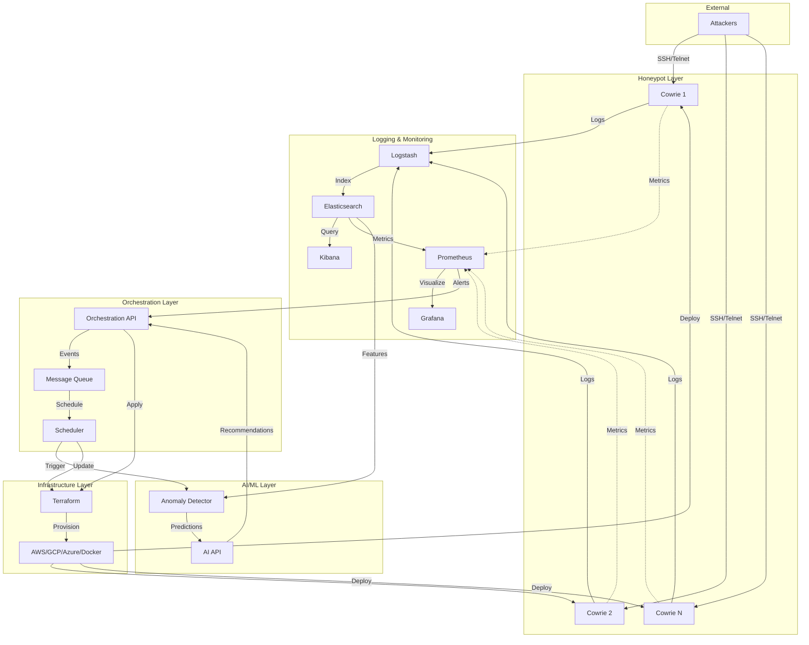

# Architecture Overview

## System Architecture

Project Asylum is built on a modular, microservices architecture with the following main components:



## Component Details

### 1. Honeypot Layer

**Technology**: Cowrie (SSH/Telnet honeypot)

**Purpose**: 
- Simulate vulnerable systems
- Capture attacker commands and behavior
- Log all interactions for analysis

**Key Features**:
- Multiple concurrent honeypot instances
- Configurable SSH/Telnet banners
- File upload/download capture
- Session recording

**Communication**:
- Sends logs to Logstash (TCP/JSON)
- Exports metrics to Prometheus
- Responds to orchestration commands

### 2. Logging & Monitoring Stack

#### Logstash
**Purpose**: Log aggregation and enrichment

**Features**:
- JSON log parsing
- GeoIP enrichment
- Anomaly score calculation
- Event categorization

#### Elasticsearch
**Purpose**: Log storage and search

**Features**:
- Full-text search
- Time-series indexing
- Aggregation queries
- Data retention policies

#### Kibana
**Purpose**: Log visualization and analysis

**Features**:
- Interactive dashboards
- Real-time log streaming
- Custom queries
- Alert visualization

#### Prometheus
**Purpose**: Metrics collection and alerting

**Features**:
- Time-series metrics storage
- PromQL query language
- Alert rules
- Service discovery

#### Grafana
**Purpose**: Metrics visualization

**Features**:
- Pre-built dashboards
- Custom panels
- Alert management
- Multi-datasource support

### 3. AI/ML Layer

**Technology**: Python + TensorFlow

**Components**:

#### Anomaly Detector
- **Architecture**: Autoencoder neural network
- **Input**: 20-dimensional feature vectors from logs
- **Output**: Anomaly scores, classifications
- **Training**: Unsupervised learning on normal behavior

**Features**:
- Real-time inference
- Model persistence
- Continuous retraining
- Threshold adaptation

#### AI API
- **Framework**: FastAPI
- **Endpoints**:
  - `/predict`: Anomaly detection
  - `/analyze`: Full analysis with recommendations
  - `/train`: Model training
  - `/state`: Current state retrieval

### 4. Orchestration Layer

**Technology**: Node.js + Express

**Components**:

#### Orchestration API
- **Purpose**: Central event hub and decision engine
- **Responsibilities**:
  - Event processing
  - Service coordination
  - Terraform triggering
  - State management

**Event Types**:
- `anomaly_detected`: AI detects anomaly
- `threshold_exceeded`: Metric crosses threshold
- `infrastructure_drift`: Terraform drift detected
- `honeypot_compromised`: Honeypot breach

#### Scheduler
- **Purpose**: Periodic task execution
- **Tasks**:
  - Log analysis (every 15 minutes)
  - Drift checking (every 6 hours)
  - Model retraining (daily)
  - Health monitoring (every 5 minutes)

#### Message Queue
- **Technology**: MQTT/RabbitMQ (optional)
- **Purpose**: Asynchronous event handling
- **Benefits**: Decoupling, reliability, scalability

### 5. Infrastructure Layer

**Technology**: Terraform

**Supported Providers**:
- Docker (local development)
- AWS (cloud deployment)
- GCP (cloud deployment)
- Azure (cloud deployment)
- Proxmox (on-premises virtualization)

**Resources Managed**:
- Virtual networks
- Compute instances
- Storage volumes
- Security groups
- Load balancers

**Features**:
- Idempotent deployments
- State management
- Drift detection
- Multi-environment support

## Data Flow

### 1. Attack Capture Flow

```
Attacker → Honeypot → Logstash → Elasticsearch → Kibana
                                              → AI Analysis
```

### 2. Anomaly Detection Flow

```
Elasticsearch → Feature Extraction → AI Model → Anomaly Score
                                               → Recommendations
```

### 3. Adaptation Flow

```
Recommendations → Orchestration API → Terraform → Infrastructure Update
                                    → Honeypot Rotation
```

### 4. Feedback Loop

```
Infrastructure → Honeypots → Logs → Analysis → Recommendations → Infrastructure
```

## Security Architecture

### Network Security
- **Isolation**: Honeypots in separate network segment
- **Firewall**: Only necessary ports exposed
- **TLS/SSL**: Encrypted communication between services
- **VPN**: Optional secure access for management

### Access Control
- **Authentication**: API keys for service-to-service
- **Authorization**: Role-based access control
- **Secrets**: Environment variables, Vault integration
- **Least Privilege**: Minimal permissions per service

### Data Security
- **Encryption at Rest**: Elasticsearch encrypted indices
- **Encryption in Transit**: TLS for all communication
- **Data Retention**: Automated log rotation and deletion
- **Backup**: Regular automated backups

## Scalability

### Horizontal Scaling
- **Honeypots**: Add more instances via Terraform
- **Logstash**: Multiple workers for parallel processing
- **Elasticsearch**: Cluster with multiple nodes
- **AI API**: Multiple replicas behind load balancer

### Vertical Scaling
- **Memory**: Increase JVM heap for Elasticsearch
- **CPU**: More cores for AI model training
- **Storage**: Larger volumes for log retention

### Auto-Scaling
- **Cloud**: Auto-scaling groups based on metrics
- **Kubernetes**: HPA for pod auto-scaling
- **Terraform**: Variable-driven node count

## High Availability

### Redundancy
- **Multiple Honeypots**: If one fails, others continue
- **Elasticsearch Cluster**: Replica shards for data redundancy
- **Load Balancing**: Distribute traffic across instances
- **Multi-AZ**: Deploy across availability zones

### Fault Tolerance
- **Health Checks**: Automatic unhealthy instance replacement
- **Graceful Degradation**: System continues with reduced capacity
- **State Persistence**: Terraform state backup and recovery
- **Model Checkpoints**: Regular AI model snapshots

## Monitoring & Observability

### Metrics
- **System**: CPU, memory, disk, network
- **Application**: Request rate, latency, errors
- **Business**: Attack rate, anomaly rate, infrastructure cost

### Logs
- **Centralized**: All logs in Elasticsearch
- **Structured**: JSON format for easy parsing
- **Searchable**: Full-text search capabilities
- **Retained**: Configurable retention policies

### Tracing
- **Service Mesh**: Request tracing across services
- **Distributed Tracing**: End-to-end transaction tracking
- **Performance**: Bottleneck identification

### Alerting
- **Prometheus Alerts**: Threshold-based alerts
- **Elasticsearch Watchers**: Log-based alerts
- **Integration**: Slack, PagerDuty, email

## Technology Stack Summary

| Layer | Technology | Purpose |
|-------|-----------|---------|
| Honeypot | Cowrie | SSH/Telnet deception |
| Log Aggregation | Logstash | Log collection & processing |
| Log Storage | Elasticsearch | Searchable log repository |
| Log Visualization | Kibana | Interactive dashboards |
| Metrics | Prometheus | Time-series metrics |
| Dashboards | Grafana | Metrics visualization |
| AI/ML | TensorFlow | Anomaly detection |
| API | FastAPI | REST interface |
| Orchestration | Node.js + Express | Event coordination |
| Scheduling | Node-cron | Periodic tasks |
| Infrastructure | Terraform | IaC provisioning |
| Containers | Docker | Service packaging |
| Orchestration | Docker Compose | Local deployment |
| CI/CD | GitHub Actions | Automated pipeline |

## Development vs Production

### Development
- Single Docker host
- Local volumes
- Minimal resource allocation
- Quick iteration
- No redundancy

### Production
- Cloud-based (AWS/GCP/Azure)
- Persistent storage
- Auto-scaling
- High availability
- Disaster recovery
- Monitoring & alerting
- Security hardening
