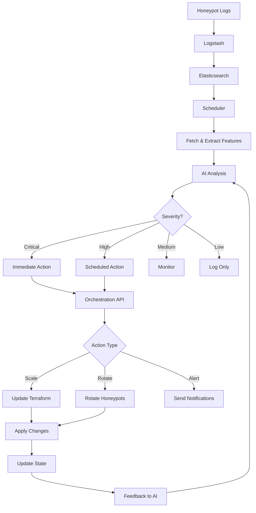

# Feedback Loop

## Overview

The Project Asylum feedback loop is the core of the system's self-adapting capabilities. It continuously monitors honeypot activity, analyzes attacker behavior using AI/ML models, and automatically adjusts infrastructure to optimize security and deception.

## Components

### 1. Data Collection
- **Source**: Cowrie honeypot logs, system metrics, network traffic
- **Method**: Logs forwarded to Elasticsearch via Logstash
- **Format**: JSON with timestamp, event type, source IP, commands, credentials

### 2. Analysis Pipeline
- **Trigger**: Scheduled (every 15 minutes) or event-driven (high anomaly score)
- **Process**:
  1. Fetch logs from Elasticsearch
  2. Extract features (connection patterns, command sequences, timing)
  3. Feed to AI anomaly detection model
  4. Calculate anomaly scores and classify behavior

### 3. Decision Engine
- **Location**: Orchestration API (`orchestration/api/server.js`)
- **Logic**:
  ```javascript
  if (anomaly_rate > 0.5) {
    // Critical: Scale infrastructure
    actions = ['scale_up', 'rotate_honeypots']
  } else if (anomaly_rate > 0.2) {
    // High: Increase monitoring
    actions = ['scale_up']
  } else if (anomaly_rate > 0.1) {
    // Medium: Monitor closely
    actions = ['increase_sensitivity']
  }
  ```

### 4. Infrastructure Adaptation
- **Tool**: Terraform
- **Mechanism**:
  1. Update `terraform/variables.tf` with new values
  2. Run `terraform plan` to preview changes
  3. Auto-apply or require approval based on severity
  4. Commit changes to version control

### 5. Model Retraining
- **Schedule**: Daily at 2 AM (configurable)
- **Process**:
  1. Collect last 24 hours of labeled data
  2. Retrain anomaly detection model
  3. Evaluate performance on validation set
  4. Deploy new model if performance improved

## Decision Thresholds

### Anomaly Rate Thresholds
- **Critical (>50%)**: Immediate infrastructure scaling, honeypot rotation
- **High (20-50%)**: Infrastructure scaling, increased alerting
- **Medium (10-20%)**: Enhanced monitoring, sensitivity adjustment
- **Low (<10%)**: Normal operation, passive monitoring

### Response Times
- **Critical**: Immediate (< 5 minutes)
- **High**: Within 15 minutes
- **Medium**: Within 1 hour
- **Low**: Next scheduled analysis

## Workflow Diagram



## Configuration

### Environment Variables

```bash
# Analysis frequency (cron format)
ANALYSIS_INTERVAL="*/15 * * * *"  # Every 15 minutes

# Infrastructure drift check
DRIFT_CHECK_INTERVAL="0 */6 * * *"  # Every 6 hours

# Model retraining schedule
MODEL_RETRAIN_INTERVAL="0 2 * * *"  # Daily at 2 AM

# Anomaly thresholds
ANOMALY_THRESHOLD_CRITICAL=0.5
ANOMALY_THRESHOLD_HIGH=0.2
ANOMALY_THRESHOLD_MEDIUM=0.1
```

### Terraform Auto-Apply Settings

For production environments, it's recommended to require manual approval:

```hcl
# terraform/main.tf
lifecycle {
  prevent_destroy = true
}
```

Enable auto-apply only for development:

```bash
export TF_AUTO_APPROVE=true  # Development only
```

## Monitoring the Feedback Loop

### Prometheus Metrics
- `orchestration_events_total{type="anomaly_handled"}`: Count of anomaly events
- `event_processing_duration_seconds`: Time to process events
- `infrastructure_state{component="terraform"}`: Current infrastructure state

### Grafana Dashboards
- **Feedback Loop Overview**: Real-time view of analysis cycles
- **Anomaly Trends**: Historical anomaly rates and patterns
- **Infrastructure Changes**: Timeline of Terraform modifications

### Kibana Queries
```json
{
  "query": {
    "bool": {
      "filter": [
        { "range": { "@timestamp": { "gte": "now-1h" } } },
        { "term": { "event_category": "feedback_loop" } }
      ]
    }
  }
}
```

## Manual Intervention

### Pausing the Feedback Loop
```bash
# Stop the scheduler
docker-compose stop scheduler

# Or disable auto-actions via environment
export FEEDBACK_LOOP_ENABLED=false
```

### Reviewing Pending Changes
```bash
# Check Terraform plan
cd terraform
terraform plan

# Review AI recommendations
curl http://localhost:8000/state
```

### Manual Trigger
```bash
# Trigger immediate analysis
curl -X POST http://localhost:3001/events \
  -H "Content-Type: application/json" \
  -d '{
    "type": "manual_analysis",
    "source": "admin",
    "data": {}
  }'
```

## Best Practices

1. **Start Conservative**: Begin with manual approval for all infrastructure changes
2. **Monitor Closely**: Watch the first 48 hours of automated operation
3. **Set Limits**: Configure maximum node count and budget limits in Terraform
4. **Version Control**: All Terraform changes should be committed and reviewed
5. **Alerting**: Set up notifications for critical severity events
6. **Backup State**: Regularly backup Terraform state and AI models
7. **Test First**: Validate feedback loop in development environment

## Troubleshooting

### Feedback Loop Not Triggering
- Check scheduler logs: `docker-compose logs scheduler`
- Verify API connectivity: `curl http://ai-api:8000/health`
- Confirm cron schedule: Check environment variables

### Too Many False Positives
- Adjust anomaly threshold: Increase `ANOMALY_THRESHOLD_CRITICAL`
- Retrain model with more representative data
- Review and tune feature extraction

### Infrastructure Not Updating
- Check Terraform state lock: `terraform force-unlock`
- Verify credentials: AWS/GCP/Azure authentication
- Review orchestration API logs: `docker-compose logs orchestration-api`

## Security Considerations

1. **Credentials**: Never commit AWS/GCP keys or secrets
2. **API Access**: Restrict orchestration API to internal network
3. **Approval Gates**: Require human approval for production changes
4. **Audit Trail**: Log all automated decisions and changes
5. **Rate Limiting**: Prevent infinite scaling loops
6. **Rollback Plan**: Maintain ability to quickly revert changes
